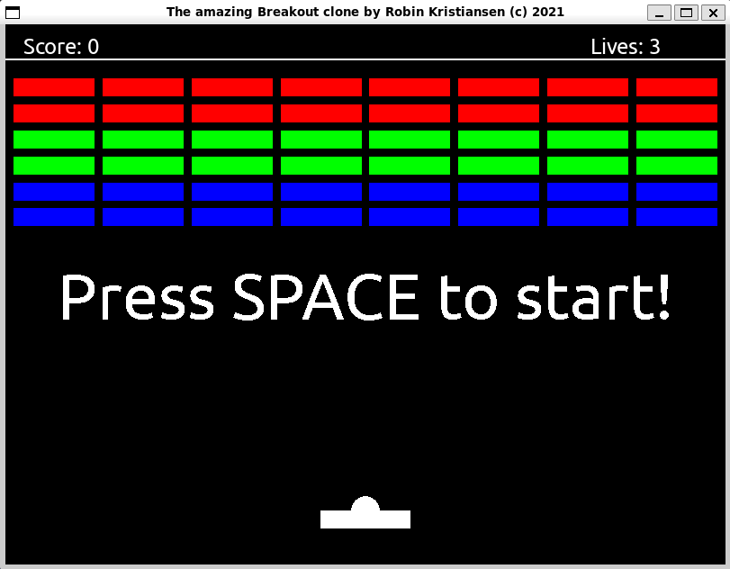

# Breakout

Implemented as part of a mandatory assignment in INF-1400 at UiT.



## Quick start

```console
$ python3 main.py
```

## Controls
|Key|Action|
|:--|:--|
| <kbd>Left arrow key</kbd> | Move paddle to the left |
| <kbd>Right arrow key</kbd> | Move paddle to the right |
